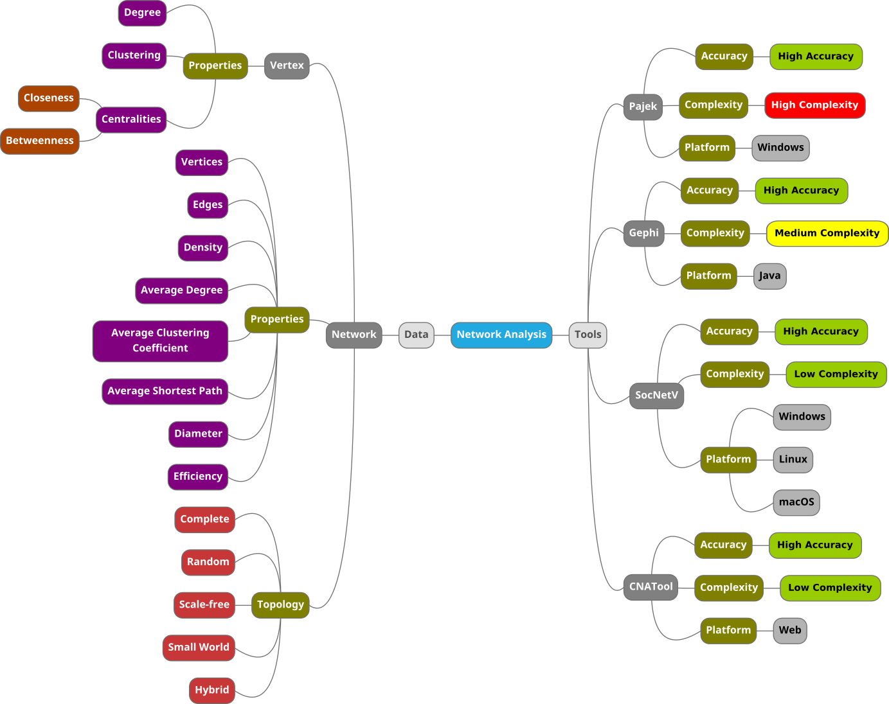

# Summary

CNATool is an innovative online program designed for analyzing complex and social networks. It provides researchers with a convenient and streamlined approach to network graph analysis, accessible from any Internet-connected device. With support for Pajek and JSON formats, CNATool offers a range of features, including the creation of artificial networks, customizable layout algorithms, and detailed visualization of network properties. Researchers can explore essential network properties such as average degree, density, clustering coefficient, shortest path, diameter, and efficiency. CNATool also provides in-depth analysis of vertex properties, enables graph saving in multiple formats (Pajek, JSON, SVG), and generates comprehensive HTML reports. The tool caters to researchers involved in social and biological network analysis, offering a user-friendly platform for exploring network properties and uncovering patterns. Potential applications include studying social networks, analyzing time-varying networks, investigating functional architecture, examining memory deterioration, exploring the impact of centrality, analyzing accident risks, modeling opinion diffusion, and studying collaborative networks among criminal members. CNATool empowers researchers to delve deeper into the intricacies of complex networks, facilitating meaningful insights and discoveries.

# Introduction

The analysis of complex networks has gained significant importance across various domains, including social, biological, and technological fields. Many phenomena in these domains can be represented as network diagrams, enabling visual analysis and leveraging tools developed for graph theory applications [@Newman2003]. Researchers have utilized network theory and computational tools to explore cooperation and collaboration processes in local productive arrangements [@Pereira2007], study collaboration between researchers [@Vieira2016], analyze the evolution of species in affinity networks [@Monteiro2014], identify linkages between stock exchanges [@Pereira2019], monitor coupled risks [@Zhou2019], and more.

Health studies have also benefited from network theory, with research on the structure and functions of the brain [@Bullmore2009] and analysis of the visual cortex in monkeys and cats [@Hilgetag2000].

These examples demonstrate the wide range of applications and tools developed for social and complex network analysis. Various software programs, including CNATool, offer researchers a convenient and streamlined approach to network graph analysis, enabling efficient exploration of network properties and uncovering patterns and insights.

# CNATool: Innovative Network Analysis Program

CNATool is an innovative online program designed specifically for analyzing complex and social networks. With its user-friendly interface and accessibility from any internet-connected device, CNATool provides researchers with a convenient and streamlined approach to network graph analysis.
Key Features:
<ul>
<li><strong>Graph Visualization:</strong> Visualization of graphs: CNATool allows the visualization of graphs, from the graphical interface, thanks to the sigma.js [@Sigma2023] library, including resources such as dynamic adjustment of the layout of the graph, either through algorithms such as ForceAtlas2, or manually dragging and positioning the vertices.
<li><strong>Graph File Formats:</strong> CNATool supports Pajek and JSON formats, allowing researchers to import network graphs effortlessly.</li>
<li><strong>Artificial Networks:</strong> Researchers can create artificial networks within CNATool, enabling customizable experimental analysis.</li>
<li><strong>Customizable Layout Algorithms:</strong> CNATool offers customizable layout algorithms, facilitating the visualization of network structures.</li>
<li><strong>Network Property Visualization:</strong> Detailed visualization of network properties, such as average degree, density, clustering coefficient, shortest path, diameter, and efficiency, helps researchers understand network characteristics.</li>
<li><strong>Vertex Analysis:</strong> CNATool provides in-depth analysis of vertex properties, enabling researchers to gain insights into individual elements within the network.</li>
<li><strong>Export and Reports:</strong> Researchers can save graphs in multiple formats, including Pajek, JSON, and SVG, and generate comprehensive HTML reports for documentation purposes.</li>
</ul>

## Potential 

Applications CNATool can be utilized in various research applications, including the study of social networks, analysis of time-varying networks, exploration of functional architecture in healthy individuals, investigation of associative memory deterioration, examination of the impact of centrality on social networks, analysis of accident risks in the construction industry, modeling of public opinion diffusion, and exploration of collaborative networks among criminal members.

By offering a comprehensive range of features and analysis capabilities, CNATool empowers researchers to delve deeper into the intricacies of complex and social networks, facilitating meaningful insights and discoveries.

# Statement of Need 

@Newman2003 presents the main concepts involved in complex and social network analysis. The author discusses the types of networks, topologies, local and global properties. Regarding the types of networks, Newman highlights social, informational, technological and biological networks. These networks, despite having different natures, present common properties such as number of vertices, number of edges, density [@Pereira2016; @Chatterjee2007], average degree, average clustering coefficient [@Schank2005], average shortest path [@Johnson1977], diameter [@Razzaque2008] and efficiency [@Latora2001]. And even at micro scale, similar parameters are observed, highlighting the clustering coefficient and the closeness [@Freeman1978; @Freeman1979; @Bhardwaj2011] and betweenness [@Freeman1977; @Brandes2001; @Barthelemy2004; @Curado2022] centralities. With regard to topologies, networks of apparently different natures, such as social and biological, often present phenomena common to small-world [@Watts1998; @Marchiori2000; @Emmert2006; @Bakshy2011] and scale-free networks [@Barabasi2002; @Crucitti2003].

Based on this view of the literature, we designed the mind map presented in \autoref{fig:pic1}. Moreover, CNATool implements some properties not found in other software, for example incidence-fidelity index [@Teixeira2010]. \autoref{tb:tb1} presents a summary of the main features presented by each of the analyzed programs. An important observation is that the Cytoscape program, although it does not allow its execution directly on the Web, as an application, it allows, through the Cytoscape.js [@Cytoscape2023] library, the creation of Web programs for visualization and analysis of network graphs. Other popular and powerful software such as igraph [@Igraph2023] and NetworkX [@NetworkX2023] were not compared as they are not user applications but programming libraries.

This program is intended for researchers working in the analysis of social and biological networks. Knowledge of network analysis and familiarity with scripting languages is essential.

| Feature	| CNATool	| Gephi	| Pajek	| SocNetV | Cytoscape | 
| :---- | ---- | ---- | ---- | ----: | ----: |
| Has high accuracy	| Yes	| Yes	| Yes	| Yes | Yes |
| Is user-friendly	| Yes	| Yes	| No	| No | Yes |
| Runs on Windows	| Yes	| Yes	| Yes	| Yes | Yes |
| Runs on Linux	| Yes	| Yes	| No | Yes | Yes |
| Runs on macOS	| Yes	| Yes	| No	| Yes | Yes |
| Runs on Android	| Yes	| No	| No	| No | No |
| Runs on iOS	| Yes	| No	| No	| No | No |
| Runs direct on web	| Yes	| No	| No	| No | Yes* |
| Calculates Efficiency	| Yes	| No	| No	| No | No |
| Calculates Incidence-fidelity	| Yes	| No	| No	| No | No|
| Uses the GPU to speed up calculations	| Yes	| No	| No	| No | Yes |

Table: Summary of the main features presented by each of the analyzed programs.\label{tb:tb1}

# Limitations

As a minor limitation, CNATool does not support the GEXF and GraphML formats, however, the tools that support these formats are generally able to export graphs in Pajek (.NET) format, allowing the interoperability of CNATool with these softwares.

# Conclusions

The CNATool tool was developed having in mind the analysis of complex and social networks from any device connected to the Internet. This application offers a friendly and intuitive user interface, while providing accurate results and detailed reports of global and local network properties being analyzed.

The program allows exporting of results in some common file formats, like Pajek and JSON and also provides a command line tool that allows batch processing, contributing to speed up analysis processes when an experiment requires calculation of properties of a large number of networks.

# References
